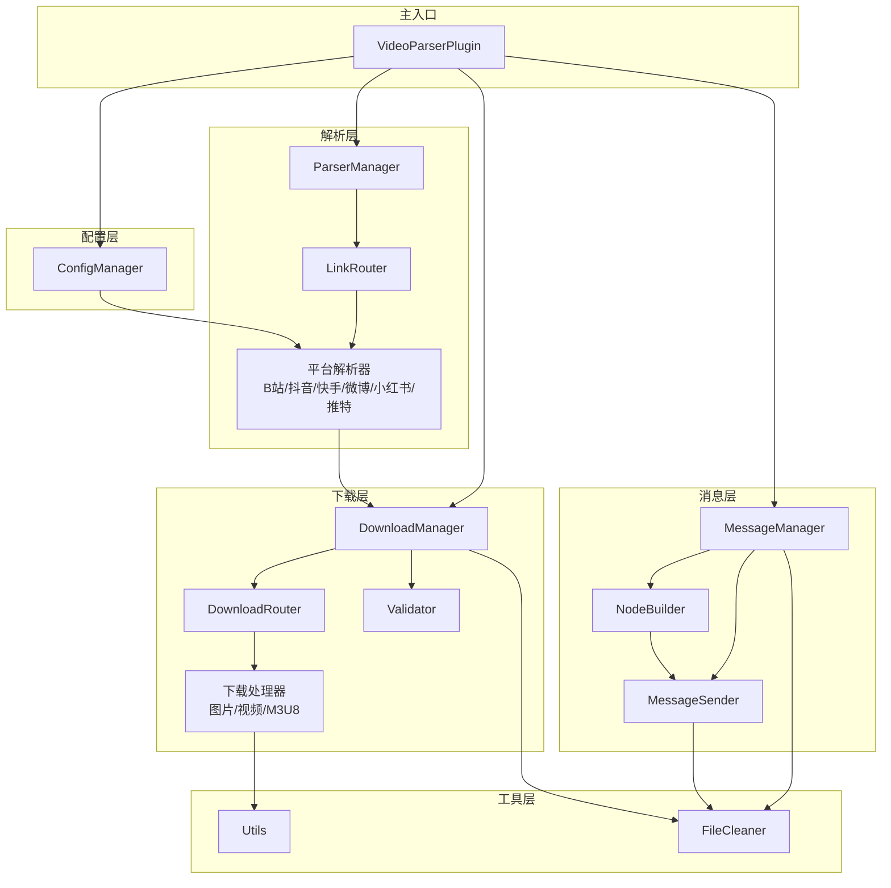
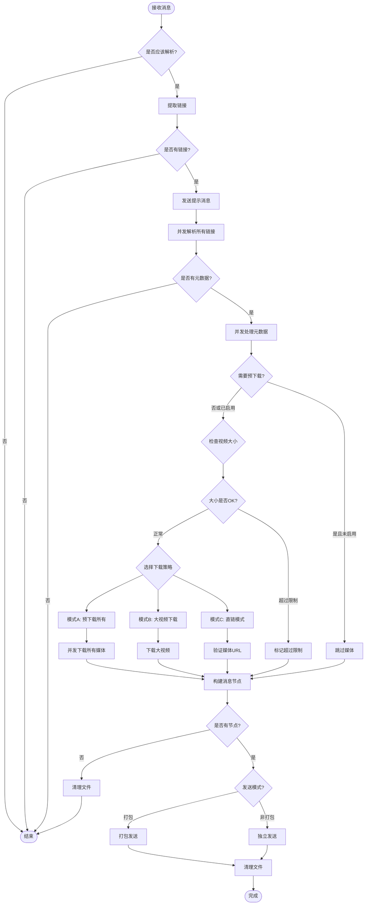

# 架构文档

## 目录

1. [整体架构](#整体架构)
2. [具体工作流](#具体工作流)
3. [异常处理](#异常处理)

---

## 整体架构

### 系统概述

本系统是一个流媒体平台链接解析插件，用于自动识别和解析各种流媒体平台的链接，提取媒体元数据，并将媒体内容转换为可直接发送的格式。系统采用模块化设计，支持多平台解析、智能下载策略和灵活的消息发送方式。

### 模块划分

系统主要分为以下几个核心模块：

#### 1. 配置管理模块 (ConfigManager)

负责读取、解析和验证配置文件，创建解析器实例，管理全局配置项。主要职责包括：

- 解析配置文件中的各项设置（触发设置、视频大小设置、下载设置等）
- 根据配置创建并初始化各个平台的解析器
- 管理代理配置（特别是Twitter平台的代理设置）
- 验证配置有效性（如确保至少启用一个解析器）

#### 2. 解析器模块 (Parser)

负责从文本中提取链接并解析为元数据。包含以下子模块：

**解析器管理器 (ParserManager)**
- 管理所有解析器实例
- 协调多个解析器的并发解析任务
- 处理解析结果的去重和合并

**链接路由器 (LinkRouter)**
- 从文本中提取所有可解析的链接
- 根据链接特征匹配对应的解析器
- 过滤重复链接和无效链接

**平台解析器 (Handler)**
- 各平台的具体解析器实现（B站、抖音、快手、微博、小红书、推特等）
- 每个解析器负责识别平台链接、提取元数据、获取媒体直链
- 返回标准化的元数据格式

#### 3. 下载器模块 (Downloader)

负责媒体文件的下载、验证和缓存管理。包含以下子模块：

**下载管理器 (DownloadManager)**
- 管理下载流程和策略选择（直链模式 vs 预下载模式）
- 检查视频大小限制
- 决定是否需要下载到本地缓存
- 协调并发下载任务

**下载路由器 (Router)**
- 根据媒体类型（M3U8、普通视频、图片）选择相应的下载处理器
- 自动检测媒体类型

**下载处理器 (Handler)**
- 图片下载处理器：下载图片到临时文件
- 普通视频下载处理器：下载视频到缓存目录
- M3U8处理器：处理HLS流媒体，支持音视频合并

**验证器 (Validator)**
- 验证媒体URL的有效性
- 检查媒体大小
- 验证Content-Type和响应内容

#### 4. 消息适配器模块 (MessageAdapter)

负责构建和发送消息。包含以下子模块：

**消息管理器 (MessageManager)**
- 协调节点构建和消息发送的完整流程
- 提供统一的接口供主流程调用

**节点构建器 (NodeBuilder)**
- 从元数据构建文本节点（标题、作者、简介等）
- 构建媒体节点（图片、视频）
- 处理打包逻辑（区分普通媒体和大媒体）

**消息发送器 (Sender)**
- 支持打包发送（使用Nodes）和非打包发送（独立发送）
- 处理大媒体的单独发送逻辑
- 管理发送过程中的资源清理

#### 5. 文件清理模块 (FileCleaner)

负责清理临时文件和缓存目录，确保资源正确释放。

### 组件关系图

### 核心类说明

#### VideoParserPlugin

主插件类，继承自AstrBot的Star基类。负责：

- 初始化所有管理器（解析器、下载器、消息管理器）
- 监听消息事件并触发解析流程
- 协调整个解析、下载、发送流程
- 处理插件生命周期（终止时清理资源）

#### ParserManager

解析器管理器，负责：

- 管理解析器列表的注册和查找
- 从文本中提取所有可解析链接
- 并发执行多个链接的解析任务
- 处理解析异常和错误结果

#### DownloadManager

下载管理器，负责：

- 根据配置决定下载策略（预下载 vs 直链）
- 检查视频大小限制
- 管理大视频的下载（超过阈值时下载到本地）
- 协调并发下载任务
- 处理下载过程中的异常

#### MessageManager

消息管理器，负责：

- 从元数据构建消息节点
- 根据配置选择打包或非打包发送方式
- 处理大媒体的单独发送逻辑
- 管理发送过程中的资源清理

---

## 具体工作流

### 完整流程概述

系统的工作流程从接收消息开始，经过链接提取、解析、下载处理、消息构建，最终发送结果。整个过程采用异步并发处理，提高效率。

### 详细工作流程

#### 1. 消息接收和触发判断

**入口点：** `VideoParserPlugin.auto_parse()`

- 系统监听所有类型的消息事件
- 从消息中提取文本内容
- 特殊处理：如果消息包含QQ小程序卡片，提取其中的跳转链接
- 判断是否应该解析：
  - 如果启用自动解析，直接处理
  - 否则检查消息是否包含触发关键词

#### 2. 链接提取和路由

**执行者：** `ParserManager.extract_all_links()`

- 使用LinkRouter从文本中提取所有可解析的链接
- 每个解析器尝试匹配链接，找到对应的解析器
- 过滤重复链接（相同链接只解析一次）
- 如果文本包含"原始链接："标记，跳过提取（防止重复解析）

#### 3. 元数据解析（并发处理）

**执行者：** `ParserManager.parse_text()`

- 对去重后的链接列表，并发调用对应的解析器进行解析
- 每个解析器返回标准化的元数据，包含：
  - 基本信息：标题、作者、简介、发布时间
  - 媒体信息：视频URL列表、图片URL列表
  - 下载配置：是否需要预下载、请求头信息、代理配置
- 解析失败时，在元数据中标记错误信息，不中断其他链接的解析

#### 4. 媒体下载和处理

**执行者：** `DownloadManager.process_metadata()`

这是最复杂的阶段，包含多个决策点：

**4.1 预下载检查**
- 如果元数据标记需要预下载，但配置未启用预下载，则跳过该媒体

**4.2 视频大小检查**
- 如果配置了最大视频大小限制，先检查视频大小
- 使用HEAD请求获取视频大小（失败时降级为GET请求）
- 如果超过限制，标记为超过大小限制，跳过下载

**4.3 下载策略选择**

系统根据配置和媒体特征选择三种模式之一：

**模式A：预下载所有媒体**
- 如果启用`pre_download_all_media`
- 并发下载所有媒体到缓存目录
- 下载完成后，使用本地文件路径构建消息节点

**模式B：大视频下载模式**
- 如果视频大小超过`large_video_threshold_mb`阈值
- 仅下载大视频到缓存目录
- 图片使用直链模式
- 大视频单独发送，不包含在转发消息集合中

**模式C：直链模式**
- 默认模式，不下载媒体文件
- 直接使用媒体URL构建消息节点
- 图片如果访问被拒绝（403），会尝试下载到临时文件

**4.4 媒体验证**
- 验证媒体URL的有效性（检查Content-Type、响应状态）
- 检测403 Forbidden错误
- 验证失败时标记为无效媒体

#### 5. 消息节点构建

**执行者：** `MessageManager.build_nodes()`

- 为每个链接的元数据构建消息节点：
  - **文本节点**：包含标题、作者、简介、发布时间、视频大小、错误信息、原始链接
  - **媒体节点**：根据`use_local_files`标志选择使用本地文件或URL
- 区分普通媒体和大媒体：
  - 普通媒体：包含在转发消息集合中
  - 大媒体：单独发送，不包含在集合中

#### 6. 结果发送

**执行者：** `MessageManager.send_results()`

根据`is_auto_pack`配置选择发送方式：

**打包模式（is_auto_pack=True）**
- 使用Nodes组件打包所有普通媒体
- 大媒体单独发送，发送前显示提示信息
- 图片图集特殊处理：文本和图片分开打包

**非打包模式（is_auto_pack=False）**
- 每个链接的节点独立发送
- 图片图集：文本单独发送，图片合并发送
- 链接之间用分隔线分隔

#### 7. 资源清理

- 发送完成后，清理所有临时文件和视频文件
- 插件终止时，清理缓存目录

### 工作流程图

---

## 异常处理

### 异常处理策略

系统采用分层异常处理策略，在不同层级捕获和处理异常，确保系统的稳定性和资源的正确释放。

### 各层级异常处理

#### 1. 解析阶段异常处理

**位置：** `ParserManager.parse_text()`

**处理机制：**
- 使用`asyncio.gather(..., return_exceptions=True)`并发执行解析任务
- 解析失败时，捕获异常并在元数据中标记错误信息
- 单个链接解析失败不影响其他链接的解析
- 解析器内部异常由解析器自行处理，不向上抛出

**异常类型：**
- 网络请求异常（超时、连接错误）
- API响应错误（404、500等）
- 数据解析错误（JSON解析失败、数据格式错误）
- 平台特定错误（视频不存在、权限不足）

**处理结果：**
- 在元数据中添加`error`字段，包含错误信息
- 保持`video_urls`和`image_urls`为空列表
- 继续处理其他链接

#### 2. 下载阶段异常处理

**位置：** `DownloadManager.process_metadata()`

**处理机制：**

**2.1 视频大小检查异常**
- HEAD请求失败时，自动降级为GET请求
- 网络异常时，标记视频大小为None，继续处理
- 403错误被特殊标记，用于后续决策

**2.2 下载任务异常**
- 使用`asyncio.gather(..., return_exceptions=True)`并发执行下载
- 单个媒体下载失败不影响其他媒体的下载
- 下载失败时，在结果中标记`success=False`
- 如果要求预下载的媒体全部失败，则跳过该类型媒体

**2.3 文件操作异常**
- 文件写入失败时，清理已创建的文件
- 目录创建失败时，标记缓存目录不可用，切换到直链模式

**异常类型：**
- 网络异常（超时、连接错误、DNS解析失败）
- HTTP错误（403 Forbidden、404 Not Found、500 Internal Server Error）
- 文件系统错误（磁盘空间不足、权限不足）
- 媒体验证失败（无效的Content-Type、JSON错误响应）

**处理结果：**
- 下载失败的媒体在`file_paths`中标记为None
- 统计失败数量（`failed_video_count`、`failed_image_count`）
- 如果所有媒体都失败，标记`has_valid_media=False`

#### 3. 消息发送异常处理

**位置：** `MessageSender.send_packed_results()` 和 `MessageSender.send_unpacked_results()`

**处理机制：**
- 使用try-finally确保资源清理
- 单个节点发送失败时，记录警告日志，继续发送其他节点
- 大媒体发送失败时，清理对应的视频文件

**异常类型：**
- 消息平台API错误
- 文件读取错误（本地文件不存在或损坏）
- 网络错误（上传文件失败）

**处理结果：**
- 发送失败的节点被跳过，不影响其他节点
- 无论成功或失败，都会清理临时文件

#### 4. 资源清理机制

**位置：** `FileCleaner` 模块和各个管理器的清理逻辑

**清理时机：**
- 消息发送完成后立即清理临时文件
- 插件终止时清理所有缓存文件
- 下载失败时清理部分下载的文件
- 超过大小限制时清理已下载的文件

**清理策略：**
- 使用`cleanup_files()`批量清理文件列表
- 使用`cleanup_directory()`清理整个目录
- 清理操作失败时记录警告，不抛出异常（避免影响主流程）

**清理范围：**
- 临时图片文件（下载到临时目录的图片）
- 视频缓存文件（下载到缓存目录的视频）
- 整个媒体目录（M3U8下载时创建的目录）

#### 5. 全局异常处理

**位置：** `VideoParserPlugin.auto_parse()`

**处理机制：**
- 最外层使用try-except捕获所有未处理的异常
- 异常发生时，记录完整异常堆栈
- 确保临时文件被清理（使用try-finally）
- 异常不会导致插件崩溃，只是本次解析失败

### 异常处理流程图

```mermaid
flowchart TD
    Start([开始处理]) --> Parse[解析阶段]
    
    Parse --> ParseError{解析异常?}
    ParseError -->|是| MarkParseError[标记解析错误<br/>继续其他链接]
    ParseError -->|否| Download[下载阶段]
    MarkParseError --> Download
    
    Download --> SizeCheck[大小检查]
    SizeCheck --> SizeError{检查异常?}
    SizeError -->|是| FallbackGET[降级为GET请求<br/>或标记为None]
    SizeError -->|否| DownloadTask[下载任务]
    FallbackGET --> DownloadTask
    
    DownloadTask --> DownloadError{下载异常?}
    DownloadError -->|是| MarkDownloadError[标记下载失败<br/>统计失败数量]
    DownloadError -->|否| Build[构建阶段]
    MarkDownloadError --> Build
    
    Build --> BuildError{构建异常?}
    BuildError -->|是| SkipNode[跳过该节点<br/>记录警告]
    BuildError -->|否| Send[发送阶段]
    SkipNode --> Send
    
    Send --> SendError{发送异常?}
    SendError -->|是| SkipSend[跳过该节点<br/>记录警告]
    SendError -->|否| Cleanup[清理资源]
    SkipSend --> Cleanup
    
    Cleanup --> CleanupError{清理异常?}
    CleanupError -->|是| LogWarning[记录警告<br/>不中断流程]
    CleanupError -->|否| End([完成])
    LogWarning --> End
    
    style ParseError fill:#ffcccc
    style DownloadError fill:#ffcccc
    style BuildError fill:#ffcccc
    style SendError fill:#ffcccc
    style CleanupError fill:#ffcccc
```

### 错误信息传递

系统通过元数据字典传递错误信息，确保错误信息能够最终展示给用户：

1. **解析错误**：在元数据中添加`error`字段
2. **下载错误**：通过`failed_video_count`和`failed_image_count`统计
3. **大小限制**：通过`exceeds_max_size`和`max_video_size_mb`标记
4. **访问拒绝**：通过`has_access_denied`标记
5. **无效媒体**：通过`has_valid_media=False`标记

这些信息最终会在文本节点中展示给用户，提供清晰的错误反馈。

### 容错机制

系统设计了多层容错机制：

1. **降级策略**：HEAD请求失败时降级为GET请求
2. **部分失败容忍**：单个媒体失败不影响其他媒体
3. **模式切换**：预下载失败时自动切换到直链模式
4. **资源保障**：使用try-finally确保资源清理
5. **异常隔离**：使用`return_exceptions=True`隔离并发任务异常

这些机制确保了系统在各种异常情况下都能保持稳定运行，不会因为单个错误导致整个流程崩溃。

